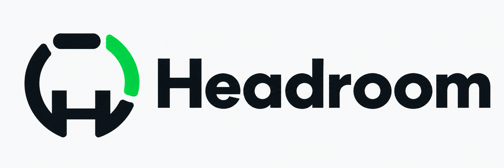

<p align="center">
  
</p>

# Headroom

A quota island for your MacBook notch. Headroom shows how much headroom you have left on Claude, Codex, Grok, and Cursor — as tiny dots beside the notch, as draining rings when you hover, and as full quota windows, reset countdowns, and local spend when you click in.

- **Compact**: one dot per signed-in CLI, coloured by urgency (green → yellow → orange → red).
- **Hover**: rings per provider showing percent remaining, the limiting window, its reset countdown, and when usage was last checked. The footer shows estimated token value and tokens for today / yesterday / 30 days.
- **Click a ring**: every quota window with its reset time and recent versus whole-window pace, provider-reported extra usage, Codex reset credits, and estimated token value. Retry a connection or snooze warnings here.
- **Alerts**: one combined banner per window for 80% / 95% usage and confident recent-pace warnings. Settings offers per-provider warnings, snooze until each current window resets, and opt-in banners when a confirmed reset restores quota after 80%+ usage.

Headroom reads the same credentials your CLIs already use and the same session logs they already write. It never writes to them, never phones home, and has no telemetry.

## Requirements

- macOS 26 (Tahoe) or later, Apple silicon.
- An island on every display: with a notch the island wraps it; without one it draws a small notch of its own at the top center.
- At least one of the [Claude Code](https://docs.anthropic.com/en/docs/claude-code), [Codex](https://github.com/openai/codex), or [Grok](https://x.ai) CLIs signed in, or the [Cursor](https://cursor.com) app.

## Install

1. Download `Headroom-x.y.z.dmg` from the [latest release](https://github.com/PeytonNowlin/Headroom/releases/latest). Each release also ships a `.sha256` file if you want to verify the download: `shasum -a 256 -c Headroom-x.y.z.dmg.sha256`.
2. Open the DMG and drag Headroom to Applications.
3. **First launch**: Headroom is ad-hoc signed, not notarized, so Gatekeeper blocks the first open. Double-click `Headroom.app`, dismiss the dialog, then go to **System Settings → Privacy & Security**, scroll to the Security section, and click **Open Anyway** next to Headroom. You only need to do this once.
4. Headroom registers itself as a login item on first run (macOS shows a "Login Items" notification); turn that off in Settings if you prefer.

If macOS says the app is "damaged", clear the quarantine flag instead: `xattr -dr com.apple.quarantine /Applications/Headroom.app`.

## Using it

| Action | Result |
| --- | --- |
| Hover the notch | Expand to rings |
| Click a ring | Drill into that provider |
| Right-click | Refresh, pin open, settings, quit |
| `⌃⌥U` (customizable) | Toggle the island from anywhere |
| Click empty island while pinned | Unpin |

Providers refresh every 5 minutes; the countdown in the island's corner shows when. Refresh Now is in the right-click menu. If a provider rate-limits us, Headroom waits out the cooldown rather than retrying.

Settings includes provider-specific sign-in guidance and **Check again** actions. Missing logins, expired credentials, failed refreshes, rate-limit cooldowns, and saved usage have distinct status messages.

Forecasts use up to an hour of local quota observations. They require at least three samples spanning ten minutes, restart after gaps or quota corrections, and suppress pace warnings when usage is bursty. They are estimates assuming the observed pace continues. Saved or failing data does not produce a forecast.

**Estimated token value is not your subscription bill.** Values use model token prices or recorded costs. An asterisk marks a partial estimate with unknown model prices; provider-reported extra usage is shown separately.

Compact indicators also use shapes: solid below 40% used, hollow at 40–69%, a dash at 70–89%, and `!` at 90%+ or for connection problems. Indicators have accessibility labels, and repeating ring animation respects Reduce Motion.

## Privacy

- Credentials are read from where the CLIs keep them (Keychain for Claude, `~/.codex/auth.json`, `~/.grok/auth.json`, Cursor's state database opened read-only) and are only ever used to call each vendor's own usage endpoint. Headroom never writes credentials and never refreshes tokens.
- Spend is computed locally from session logs (`~/.claude/projects`, `~/.codex/sessions`, `~/.grok/sessions`). Cursor has no local log, so its last 30 days are fetched from your own Cursor dashboard export and priced locally. Nothing else leaves your machine except an hourly fetch of public model pricing (LiteLLM, models.dev, and OpenUsage's supplement).
- Quota history stores only timestamps and percentages in Headroom’s own Application Support directory, bounded to the most recent hour of observations per current window. No prompts or credentials are included.
- No analytics, no crash reporting, no accounts.

## Build from source

```sh
swift test
script/build.sh            # debug → build/Headroom.app
script/build.sh release
```

To generate synthetic native layout captures without accessing real logins:

```sh
HEADROOM_UI_ARTIFACTS="$PWD/.build/ui-checks" swift test --filter IslandRenderingTests
```

These captures check native text and layout; AppKit's view capture does not reproduce the desktop glass backdrop. Verify glass appearance and VoiceOver navigation in the running app; the SwiftPM test host does not expose the full accessibility tree.

Releases are cut with `script/release.sh vX.Y.Z`, which runs the tests, builds arm64 release, signs ad-hoc, packages a DMG, tags, and publishes a GitHub Release with the matching `CHANGELOG.md` section as notes.

## Credits

Provider adapters and spend parsing are ported from [openusage](https://github.com/robinebers/openusage); the Liquid Glass island is inspired by [tokenly](https://github.com/itsSwanks/tokenly). See `NOTICE`.

MIT licensed.
